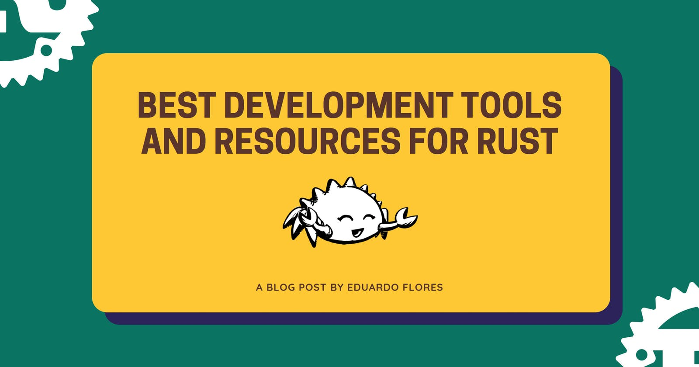

As new Rust developers, we constantly encounter new challenges, especially coming from languages like JavaScript or Python. Rust isn't as familiar as other languages, but being a modern language it brings many benefits to the table that other older languages don't.

The purpose of this article is to help Rust developers find tools and resources to make the most out of their developer experience. If you are reading this and Rust is not installed in your system head over to this [website](https://www.rust-lang.org/tools/install) and install it.

# Learning Rust

If you are new to Rust, you are going to want to read [The Rust Book](https://doc.rust-lang.org/book/), which is a free book containing everything you need to know about the language, you can alternatively buy the [book](https://www.amazon.com/Rust-Programming-Language-Covers-2018/dp/1718500440/ref=tmm_pap_swatch_0?_encoding=UTF8&qid=&sr=) online if you prefer paperback books.

Reading the book will give you a better understanding of the design choices made by the [Core Team](https://www.rust-lang.org/governance/teams/core) and what are the differences of Rust in comparison to other languages, this will make it easier for you to get started writing code!

After you are done with the book check the [learning section](https://www.rust-lang.org/learn) on the Rust website, it contains many more resources for you to continue your journey into becoming a Rustancean.

You should also check out [Jon Gjengset](https://www.youtube.com/c/JonGjengset/videos) YouTube channel and join the Rust [Discord](https://discord.gg/RS3Ntb9) server.

> This book assumes that you’ve written code in another programming language, having personally read the book I can assure you that you don't want to read this book as your first language unless you are very interested in systems development.

# Code Editor vs IDE

## Visual Studio Code

When I started learning Rust I used [Visual Studio Code](https://code.visualstudio.com/), it is a fantastic code editor with a lot of extensibility, even to the point as making it work as a complete IDE, updates constantly bring new features and performance keeps getting better as Microsoft pushes [Electron](https://www.electronjs.org/) forward.

Although my experience writing Rust code was good, it lacked some features other development tools like JetBrains CLion have, such as type inference and in-depth coding assistance which is very nice to have.

Nevertheless, my experience was really pleasant and I could comfortably go back to Visual Studio Code.

#### Rust extensions for Visual Studio Code

1. [Rust](https://marketplace.visualstudio.com/items?itemName=rust-lang.rust)
2. [Rust Grammar](https://marketplace.visualstudio.com/items?itemName=miqh.vscode-language-rust)
3. [vscode-rust-syntax](https://marketplace.visualstudio.com/items?itemName=dunstontc.vscode-rust-syntax)
4. [Better Toml](https://marketplace.visualstudio.com/items?itemName=bungcip.better-toml)
5. [rust-analyzer](https://marketplace.visualstudio.com/items?itemName=matklad.rust-analyzer)

#### Other Tools

1. [Code Runner](https://marketplace.visualstudio.com/items?itemName=formulahendry.code-runner)
2. [How to debug Rust in Visual Studio Code](https://www.forrestthewoods.com/blog/how-to-debug-rust-with-visual-studio-code/)
3. [Error Handling](https://marketplace.visualstudio.com/items?itemName=usernamehw.errorlens)

## JetBrains CLion

When I made the switch to CLion I immediately noticed a much better integration of the IDE with Rust. The [Rust Plugin](https://intellij-rust.github.io/) developed by JetBrains is the single piece of software that convinced me to switch from Visual Studio Code to CLion, here are some of the features that caught my eye.

- Right-click to create new files has Rust templates.
- The Cargo plugin allows you to run cargo commands with one click.
- Debugging is already integrated with the IDE.
- Preview the types of your variables as you write your code in real-time thanks to type inference.

Click [here](https://intellij-rust.github.io/features/) for a full list of features.

#### Plugins

1. [Toml](https://plugins.jetbrains.com/plugin/8195-toml/)

Of course, CLion is not free software, but you can get a free license if you are a [student](https://www.jetbrains.com/community/education/#students). If you are not a student you can still get a [free or discounted license](https://www.jetbrains.com/clion/buy/#discounts?billing=yearly), alternatively you can buy CLion [here](https://www.jetbrains.com/clion/buy/#personal?billing=yearly).

# Conclusion

The resources in this article are not exhaustive, these are just some of the resources that helped me in my journey into becoming a Rustacean, it covers some of the best resources to learn Rust and how to set up your development environment to take full advantage of the tools we have available.

> If you enjoyed this article, consider sharing it so more people can benefit from it! Also, feel free to [@me](https://twitter.com/edfloreshz) on Twitter.
